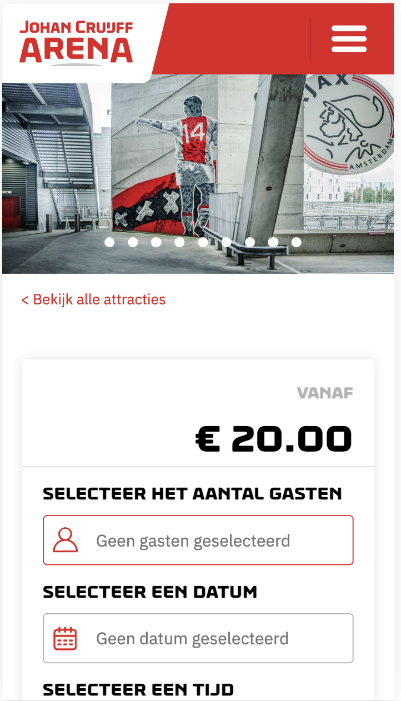

# Procesverslag
Markdown is een simpele manier om HTML te schrijven.  
Markdown cheat cheet: [Hulp bij het schrijven van Markdown](https://github.com/adam-p/markdown-here/wiki/Markdown-Cheatsheet).

Nb. De standaardstructuur en de spartaanse opmaak van de README.md zijn helemaal prima. Het gaat om de inhoud van je procesverslag. Besteedt de tijd voor pracht en praal aan je website.

Nb. Door *open* toe te voegen aan een *details* element kun je deze standaard open zetten. Fijn om dat steeds voor de relevante stuk(ken) te doen.

## Jij

  
uitwerken voor kick-off werkgroep

  ### Auteur:
  Jornt Bon

  #### Je startniveau:
  Blauw

  #### Je focus:
  Surface Plane
 

## Je website

  
uitwerken voor kick-off werkgroep

  ### Je opdracht:
  https://www.johancruijffarena.nl/home/
  https://tickets.johancruijffarena.nl/productDetail/22242?lang=nl

  #### Screenshot(s) van de eerste pagina (small screen): 
  Johan Cruijff Arena Home  
  

  #### Screenshot(s) van de tweede pagina (small screen):
  Johan Cruijff Arena Product Page 
  
 

## Toegankelijkheidstest 1/2 (week 1)

  
Op het gebied van toegangkelijkheid scoort de Johan Cruijff ArenA website niet erg hoog. Het navigeren met de 'tab' toets werkt heel slecht. Er is geen duidelijkheid waar de gebruiker zich bevind, niet alle tab elementen zijn uberhaupt zichtbaar én er ontbreken veel alt teksten.
Content technisch, qua contrast, tekst- en kleur gebruik, is er weinig mis met de website. Genoeg ruimte tussen de elementen, website kan gemakkelijk draaien.

Headings van de website zijn correct. Wordt gebruik gemaakt van een list. Sommige afbeeldingen missen wel alt-teksten.

De video op de pagina staat op auto-play, hier kan de gebruiker geen verandering in brengen... Bij sommige videos zijn geen captions. Dingen die knoppen moeten voorstellen, zijn geen èn geen skip link.... Al met al niet al te best!

## Breakdownschets (week 1)

  
uitwerken na afloop 3e werkgroep

  ### de hele pagina: 
  

  ### dynamisch deel (bijv menu): 
  

  ### wellicht nog een dynamisch deel (bijv filter): 
  

## Voortgang 1 (week 2)

  
uitwerken voor 1e voortgang

  ### Stand van zaken
Was goed van start, helaas was ik begonnen bij het ontwerpen van een volledig computer scherm. 
Wel lekker veel geschreven, waardoor het algehele gevoel van CSS'en wel weer wat terug kwam

  ### Agenda voor meeting
  samen met je groepje opstellen

  | Jornt --- Hoe kom ik aan deze GIF? Hoe werkt downloaden van een font ook alweer?
  | Magdalena ---       
  | Liam ---   
  | Esra ---    
  | Sarah ---

  | Allemaal --- Helaas hadden we deze sessie niet goed voorbereid. Volgende sessie zal de agenda up-to-date zijn!
   

  ### Verslag van meeting

  Uitleg ontvangen hoe alle media op een website gevonden kan worden. 
  Ook weer fris in het geheugen hoe fonts (gedownloade) ingeladen worden in de website.
  Volgende keer beter voorbereiden voor de sessie.

## Voortgang 2 (week 3)

  
uitwerken voor 2e voortgang

  ### Stand van zaken
  Gaat eigenlijk allemaal wel goed. Klein moment van wanhoop gehad toen ik van groot scherm naar klein wilde gaan.
  Leek onmogelijk. Toen alles verwijderd, vanaf start weer gaan CSS'en, gaat de goede kant op!

  ### Agenda voor meeting
  samen met je groepje opstellen

  - Liam: Afbeeldingen caroussel met animatie. Nth-of-type voor de kleur van tekst lukt niet. Hoe kun je het beste de iconen in de navbar doen.

  - Esra: Ik struggle op dit moment met mijn iconen rechts krijgen in het menu. Ik wil dat het logo rechts blijft, en mijn logo links. Mijn afbeelding in de eerste section is heel condensed terwijl ik wel de juiste afmetingen en afbeelding heb gebruikt.

  - Sarah: Header images overhoop gehaald, hoe fix ik dit? Hoe maak ik een button van een img en een woord samen? Hoe spreek ik alleen het logo aan, laatste img van de header in de tweede nav?

  - Karenza: @fontface snap ik even niet, verschil tussen flex en grid, wanneer is wat beter?

  - Jornt: Ik wil graag weten hoezo mijn 2e section niet het scherm volledig vult. Ook wil ik weten waarom ik de 'font-weight' van m'n nav niet kan aanpassen. 
         Tijdens het testen kwam ik erachter dat het kruisje niet laadt. Hoe kan dit?

  ### Verslag van meeting
  
  - de body heeft standaard CSS meegekregen. Zet dit op 'unset' om margins te voorkomen.
  - Font-weights moeten nog gedownload worden. Nu heb ik enkel de 'regular' erin zitten.
  - Het kruisje stond locaal op m'n computer geroot. Deze folder path moet opnieuw worden geschreven.

## Toegankelijkheidstest 2/2 (week 4)

  
uitwerken na test in 9e werkgroep

  ### Bevindingen
  Lijst met je bevindingen die in de test naar voren kwamen (geef ook aan wat er verbeterd is):
  - Website is erg toegankelijk, met duidelijke visuele elementen zodat de gebruiker goed ziet waar hij / zij zich begeeft
  - Goed gebruik van alt-teksten en aria-labels.
  - Mijn HTML is (buiten een UL in ul element) veel beter gevalideerd dan de originele HTML.

## Voortgang 3 (week 4)

  
uitwerken voor 3e voortgang

  ### Stand van zaken
  hier dit ging goed & dit was lastig (neem ook screenshots op van delen van je website en code)

  ### Agenda voor meeting
  samen met je groepje opstellen

  Jornt:
  -  Waarom blijft niet mijn gehele NAV bar plakken?
  - Hoe krijg ik m’n tekst in dit sectie 4 responsive?
  - Er zijn maar 3 fonts beschikbaar om te downloaden, lukt niet om font-weight mee te geven.

  Sarah:
  - Ik kan de fonts niet vinden omdat ze geen duidelijke namen hebben.
  - Hoe maak ik een rondje boven het winkelmandje?
  - Hoe krijg ik een link en een p die onder elkaar staan, dichter op elkaar?

  Esra:
  - Hoe zorg ik ervoor dat de tekst in een section automatisch veranderd?
  - Hoe rep ik de eerste p in een section aan?
  - Hoe krijg ik de Jordan en Converse onder elkaar in m'n NAV?

  Liam:
  - Hoe krijg ik 3 verschillende menu opties?
  - Hoe maak ik slideshow met animaties?
  - Hoe zorg ik ervoor dat ik verschillende menus kan sluiten met 1 knop?
 

  ### Verslag van meeting
  
  img moet onderin het kopje, s4/s3. H2,H3 & H4 geen position absolute, gebruik padddings. padding: 0 0.75rem; Denk aan responsiveness! NAV mag zo blijven, is een browser bug. Voeg fallback fonts toe bij elke font-family. -webkit-font-smoothing: antialiased;
  

## Eindgesprek (week 5)

  
uitwerken voor eindgesprek

  ### Je uitkomst - karakteristiek screenshots:
  
  

  ### Dit ging goed/Heb ik geleerd: 
  Ik heb ontzettend veel geleerd. Belachelijke hoeveelheden code geschreven. Frustratie op hoog niveau ervaren als iets niet lukt.
  Veel mogelijkheden binnen CSS geleerd. Hoe dingen efficienter kunnen, hoe je responsive (enigszins) kan coderen.
  Het belang van een correcte HTML structuur. Denk dat mijn website weldegelijk beter toegankelijk is dan het origineel.
  Vet veel geleerd!

  ### Dit was lastig/Is niet gelukt:
  Graag had ik de caroussel nog verbetert. De 'current' een rode kleur gegeven en pijltjes om te navigeren implementeren.
  Volgende keer dat ik een website ga ontwerpen begin ik mobile first, grote fout geweest om voor desktop te beginnen.
  Verder ben ik wel erg tevreden met hoe identiek de site lijkt op het origineel. Wat zeker beter had gekund,
  is de efficientie van de code. Denk dat er zo 700 regels code af kunnen, alleen ga ik 'm nu niet meer aanraken haha.

  

## Bronnenlijst

  
continu bijhouden terwijl je werkt

  Nb. Wees specifiek ('css-tricks' als bron is bijv. niet specifiek genoeg). 
  Nb. ChatGpT en andere AI horen er ook bij.
  Nb. Vermeld de bronnen ook in je code.

  1. Voor de carousel op de detailpagina: https://codepen.io/shooft/pen/KKgXJVm. - Sanne van 't Hooft
  2. voor micro animatie: https://www.sitepoint.com/button-micro-interactions/

